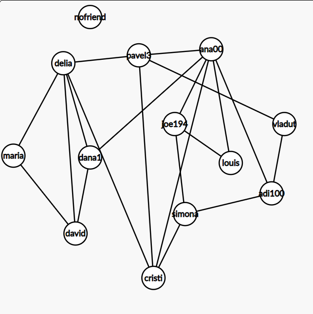

# APi home assessment

For testing the algorithm that computes the length of the shortest chain of friends between user A and user B, I created a social network represented in this picture like a graph, where nodes are users and every edge between a node means that two users are friends.

